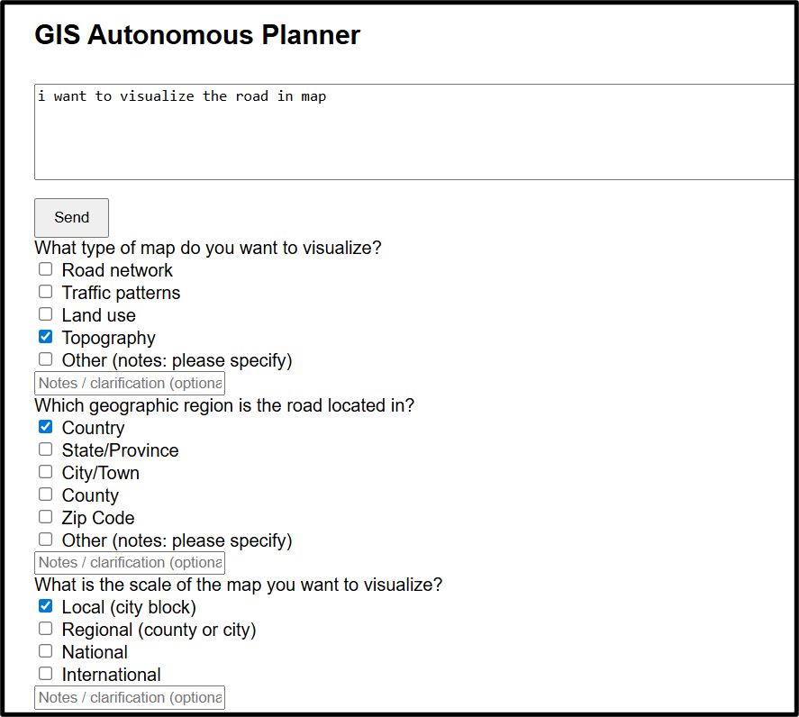

# AI Task Planner – Autonomous Agent System

A **domain-agnostic, LLM-powered autonomous agent system** that converts free-form user input into **structured, validated task requirements** using intent detection, planning, and human-in-the-loop refinement.

This project focuses on **AI system design**, not chatbots emphasizing controllability, reliability, and extensibility for real-world workflows.


##  Key Features

* **Intent Detection** – Distinguishes casual conversation from actionable task requests
* **Planner Agent** – Dynamically generates structured input forms from natural language
* **Human-in-the-Loop Validation** – Confirmation and refinement loop to prevent hallucinations
* **Strict Output Control** – Enforced prompt constraints for predictable responses
* **Domain-Agnostic Design** – Easily adaptable to any task-oriented workflow
* **Production-Ready Backend** – Built using FastAPI with modular agent orchestration


##  System Architecture

The system follows a multi-agent pipeline:

1. **Understanding Agent** – Classifies user intent
2. **Conversational Agent** – Handles non-task chat politely
3. **Steering Agent** – Gently redirects users toward task definition
4. **Planner Agent** – Extracts requirements and generates structured forms
5. **Confirmation & Refinement Agent** – Validates and updates task understanding


##  Tech Stack

* **Backend:** FastAPI
* **LLM Inference:** Ollama (local models)
* **Prompt Engineering:** Schema-driven, deterministic outputs
* **Language:** Python
* **API Design:** REST, CORS-enabled


## Getting Started

### Prerequisites

* Python 3.9+
* Ollama installed and running
* Supported LLM model pulled locally

### Run the Server

```bash
uvicorn app:app --reload
```


## Example Use Cases

* AI-powered task intake systems
* Autonomous workflow planners
* LLM-based requirement extraction
* Human-in-the-loop AI validation pipelines


## Design Philosophy

* Avoid early assumptions
* Separate understanding from execution
* Combine deterministic control with generative reasoning
* Keep humans in the loop for critical decisions



## License

MIT License


If you use or extend this project, feel free to credit or reach out.
